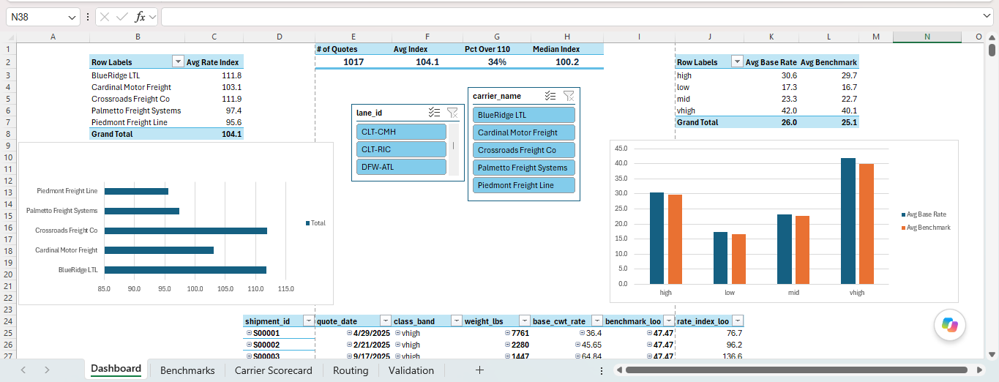
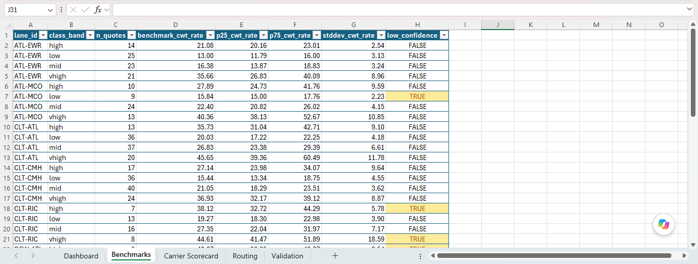
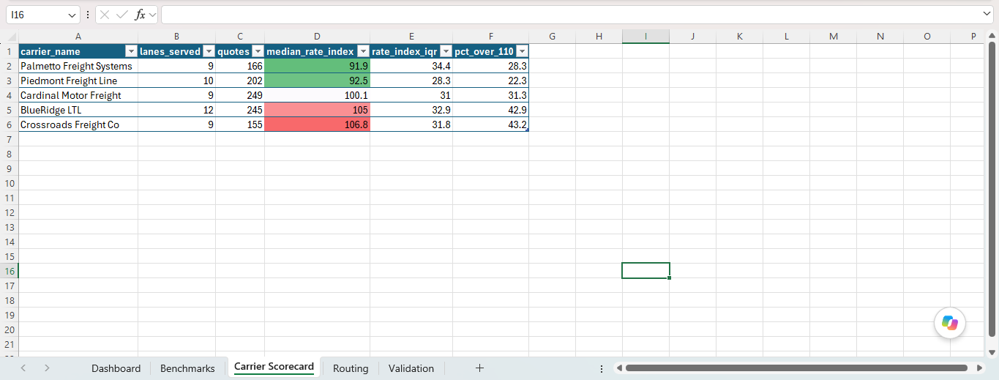
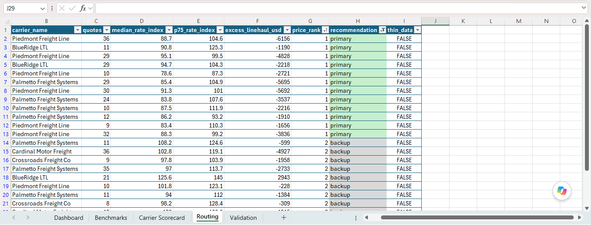
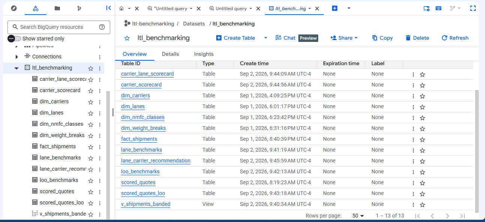
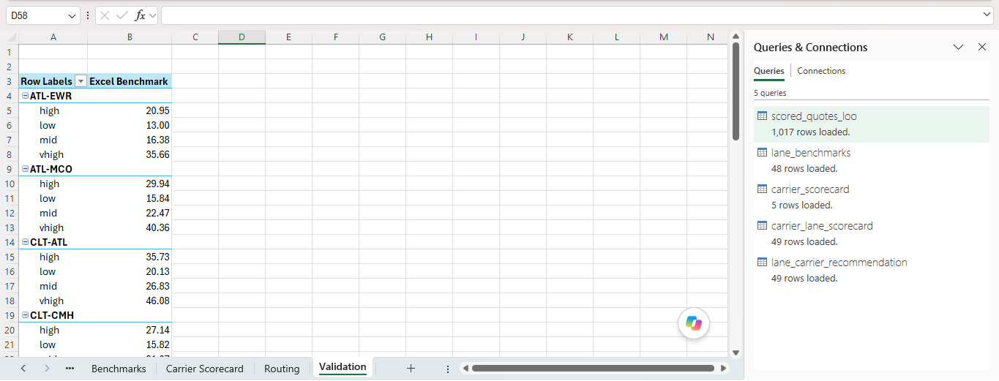

# LTL Carrier Rate Benchmarking

**SQL | Excel | LTL Freight Analytics**

[](./Findings_Memo.md)

A shipper gets an LTL freight quote. Is that rate competitive for the lane and freight class, or is the carrier pricing over market? This project answers that question against a 1,024-quote dataset: benchmark every quote in BigQuery, flag the carrier-lanes priced above market, and hand back a routing plan in Excel.

---

# Project Overview

Small and mid-size shippers rarely have a rate benchmark. They book LTL freight against one or two carriers, take the quote they are given, and have no read on whether a lane is being overpriced until a freight bill audit catches it months later.

This is a carrier rate benchmarking analysis built the way a transportation analyst would run it. The unit of measure is the linehaul rate (cost per hundredweight, before fuel and accessorials), because that is the part of an LTL rate a carrier actually negotiates. Every quote is scored against the median for its lane and freight-class band, computed from the *other* carriers so a dominant carrier never sets the benchmark it is judged against. Carrier-lane combinations more than one standard deviation above market get flagged, and each flagged lane gets a routing recommendation.

The dataset is synthetic. Real shipment-level LTL rate data is paid and proprietary, so the 5 carriers are fictional (Piedmont, Palmetto, Cardinal, BlueRidge, Crossroads) with persistent per-carrier pricing positions and lane footprints built into `generate_dataset.py`. Every rate assumption in that script is sourced against `LTL_Domain_Mechanics.md`.

[](./analysis_runbook.md)

---

# What's Inside

### 1️⃣ Findings Memo

The one-page deliverable: bottom-line dollars, carrier price positions, the flagged carrier-lanes, and the routing actions. Written for a transportation manager, not an analyst.

[](./Findings_Memo.md)

### 2️⃣ SQL Analysis

The full BigQuery pipeline, seven queries from raw quotes to routing recommendations:

| Query | Output |
|---|---|
| `01_banded_view.sql` | `v_shipments_banded` — adds the 4-band freight-class grouping |
| `02_lane_benchmarks.sql` | `lane_benchmarks` — median linehaul rate per lane and class band |
| `03_leave_one_out_benchmarks.sql` | `loo_benchmarks` — each carrier's benchmark from its peers only |
| `04_scored_quotes_loo.sql` | `scored_quotes_loo` — every quote indexed against its LOO benchmark |
| `05_carrier_lane_scorecard.sql` | `carrier_lane_scorecard` — price position and excess linehaul per carrier-lane |
| `06_carrier_scorecard.sql` | `carrier_scorecard` — overall price position and consistency per carrier |
| `07_lane_carrier_recommendation.sql` | `lane_carrier_recommendation` — primary and backup carrier per lane |

[](./queries)

### 3️⃣ Excel Workbook

`LTL_Rate_Benchmarking.xlsx` — the SQL result tables loaded through Power Query into the Data Model, formatted Benchmarks / Carrier Scorecard / Routing sheets, a Dashboard sheet with lane and carrier slicers driving a KPI strip (three DAX measures), a carrier-position chart, and a rate-vs-benchmark chart. A Validation sheet recomputes the benchmark independently with Excel's own `MEDIAN` and matches the SQL to the cent.





[](./LTL_Rate_Benchmarking.xlsx)

### 4️⃣ Dataset

Star schema, 1,024 rows in `data/`: `fact_shipments` plus four dimension tables (`dim_lanes`, `dim_carriers`, `dim_nmfc_classes`, `dim_weight_breaks`), and a denormalized `ltl_shipment_quotes` for the Excel side. 12 US lanes from 215 to 925 miles, 5 carriers, quotes across January to December 2025.

`ltl_dataset_generation.ipynb` is the narrated build with every rate assumption sourced; `generate_dataset.py` is the same logic as a plain script. Both write identical files.

[](./ltl_dataset_generation.ipynb)

### 5️⃣ LTL Domain Reference

`LTL_Domain_Mechanics.md` — freight class, density, weight breaks, CWT rating, and accessorials, with sources. The domain knowledge the analysis assumes.

---

# Methodology Decisions

Five calls that shaped the analysis. Each is defensible and each has an alternative that was tried and rejected.

| Decision | What was chosen | Why not the alternative |
|---|---|---|
| **Freight-class grouping** | 4 class bands (low 50-70, mid 77.5-110, high 125-150, vhigh 175-250) | 3 bands lumped classes spanning 1.6x in rate into one cell, a 37% within-cell coefficient of variation. 4 bands brought every band to about 0.23-0.25. |
| **Benchmark unit** | `base_cwt_rate`, the linehaul cost per hundredweight | `quoted_rate_total` mixes freight class, weight, and accessorials, none of which a carrier negotiates the same way as the linehaul rate. |
| **Benchmark construction** | Leave-one-out: each carrier scored against the median of the *other* carriers on that lane-band | A plain median lets a carrier that dominates a lane set the benchmark it is then measured against. Only 7 of 1,024 quotes drop for having no peer. |
| **Weight dimension** | None. Flag carrier-lane combinations, not individual quotes | A light/heavy split left 41 of 46 light-weight cells too thin to benchmark. Weight mix cancels in a carrier-vs-carrier comparison anyway, since every carrier quotes the same weight spread. |
| **"Above market" threshold** | Rate index over 110 | Carrier-lane positions scatter with a standard deviation of about 10.6 around 100. Over 110 is one SD out, past what quote-to-quote sampling explains. A second tier at over 120 means act now. |

---

# Key Findings

**Linehaul spend above the lane benchmark totals $7,759 across 6 carrier-lane pairs.** BlueRidge LTL is four of the six and about $6,100 of it. The fix is routing discipline on 5 lanes. No rate negotiation needed.

### Carrier price position (100 = market)

| Carrier | Median index | Consistency (IQR) | Lanes served |
|---|---|---|---|
| Palmetto Freight Systems | 92 | wide, 34 | 9 |
| Piedmont Freight Line | 93 | tight, 28 | 10 |
| Cardinal Motor Freight | 100 | 31 | 9 |
| BlueRidge LTL | 105 | 33 | 12 |
| Crossroads Freight Co | 107 | 32 | 9 |

Piedmont and Palmetto both price about 8% below market. Palmetto is marginally cheaper but its quotes swing wider, so Piedmont is the more dependable primary.



### Flagged carrier-lanes

| Lane | Carrier | Index | Excess linehaul | Note |
|---|---|---|---|---|
| CLT-RIC | BlueRidge LTL | 126 | $2,943 | currently the backup carrier |
| DFW-ATL | BlueRidge LTL | 116 | $1,980 | high volume |
| CLT-ATL | Cardinal Motor Freight | 114 | $1,776 | high volume |
| ATL-EWR | BlueRidge LTL | 114 | $731 | |
| GSO-BNA | BlueRidge LTL | 126 | $448 | thin data, 9 quotes |
| ATL-MCO | Crossroads Freight Co | 115 | -$119 | net neutral on dollars |

The `lane_carrier_recommendation` table is the routing plan: cheapest carrier per lane labeled `primary`, runner-up `backup`, carrier-lanes under 8 quotes carried through as `thin_data`.



Full recommendations and caveats are in the [findings memo](./Findings_Memo.md).

---

# How It Was Built

**BigQuery** (`ltl-benchmarking.ltl_benchmarking`): the five source CSVs load as tables, then a view and six query-built tables run the benchmark chain. `APPROX_QUANTILES(rate, 100)[OFFSET(50)]` is the median idiom inside each `GROUP BY`. The leave-one-out benchmark is a self-join of the banded view that excludes the carrier being scored.



**Excel** (Power Query + Power Pivot): the result tables load to the Data Model, a merge query joins each quote to its benchmark, and DAX measures drive the Dashboard. The Validation sheet is the check that matters in an interview: Excel's own `MEDIAN` over the raw quotes reproduces the SQL benchmark, so the number is not an artifact of one tool.



`analysis_runbook.md` walks the BigQuery setup and the Excel build step by step. The `queries/` folder holds the full SQL chain as run.

---

# Repository Structure

```
LTL-Carrier-Rate-Benchmarking/
├── Findings_Memo.md              findings and routing actions
├── analysis_runbook.md           BigQuery + Excel build walkthrough
├── LTL_Domain_Mechanics.md       freight class, density, weight breaks, accessorials
├── ltl_dataset_generation.ipynb  narrated synthetic dataset build
├── generate_dataset.py           the same logic as a script
├── LTL_Rate_Benchmarking.xlsx    Power Query + Power Pivot workbook
├── queries/                      the 7-query BigQuery chain
├── data/                         5 source tables + 5 analysis outputs (CSV)
└── screenshots/
```

---

# Tools Used

- **BigQuery** — SQL benchmarking, leave-one-out medians, carrier scoring
- **Excel** — Power Query, Power Pivot, DAX, slicer-driven dashboard, independent validation
- **Python (pandas)** — synthetic dataset generation only
- **NMFTA / ODFL / Translogistics / PartnerShip** — LTL domain sources (see `LTL_Domain_Mechanics.md`)

---

# Author

**Sawandi Kirby**

Data Analytics & Business Intelligence
Benchline Analytics - Data intelligence for organizations that mean business.

- GitHub: https://github.com/visualkirby
- LinkedIn: https://linkedin.com/in/sawandi-kirby
- Kaggle: https://kaggle.com/sawandikirby
